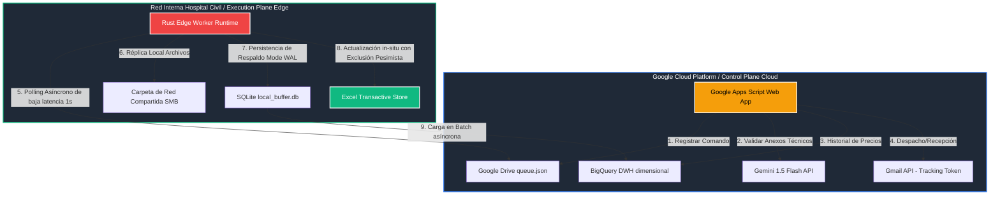

# ⚖️ Sistema-DSA: Sistema Híbrido de Adjudicación de Compras

[](https://www.iso.org/standard/72295.html)
[](https://iso25000.com/index.php/normas-iso-25000/iso-25010)
[](https://www.rust-lang.org/)
[](https://cloud.google.com/)

---

## 🌐 1. Resumen de Arquitectura e Innovación

El **Sistema-DSA** es una plataforma híbrida de nivel corporativo desarrollada para la **División de Servicios Administrativos del Hospital Civil de Guadalajara (HCG)**. Su objetivo es automatizar, auditar y dotar de integridad transaccional al ciclo de compras bajo el esquema de **Fondo Revolvente**.

Para resolver el reto normativo de **Cero Puertos Entrantes Abiertos (Zero Inbound Ports)** en la red hospitalaria, la arquitectura del sistema bifurca de forma segura sus componentes operacionales:

* **Control Plane en la Nube (Google Cloud Serverless):** Administra el portal del operador a través de Google Apps Script, automatiza la intercepción de cotizaciones en Gmail, realiza el modelado de afinidad y benchmark de precios mediante BigQuery y ejecuta la validación de anexos técnicos mediante inteligencia artificial multimodal (**Gemini 1.5 Flash**).
* **Execution Plane en el Edge (Windows 11 / Rust Runtime):** Un demonio local en Rust que realiza polling asíncrono con Tokio, sincroniza el inventario heredado parseando CSVs legacy, controla la replicación de archivos sobre unidades compartidas (SMB) y opera como conductor transaccional modificando en tiempo real archivos Microsoft Excel locales mediante exclusión mutua pesimista basada en el sistema operativo.

---

## 🏗️ 2. Diagrama de la Arquitectura del Sistema

El siguiente diagrama visualiza cómo interactúan los componentes en la nube con el Edge local utilizando el patrón de **Cola de Comandos Inversa**:



---

## 🏛️ 3. Alineación de Calidad de Software (ISO/IEC 25010)

El desarrollo del Sistema-DSA se rige rigurosamente bajo los estándares internacionales de la norma **ISO/IEC 25010**:

| Atributo de Calidad | Especificación en el Sistema-DSA | Beneficio de Negocio |
| :--- | :--- | :--- |
| **Fiabilidad (Reliability)** | Persistencia Write-Ahead Log (WAL) en SQLite local ante caídas de red y reintentos automáticos con Exponential Backoff hasta 300s. | **Cero pérdida de datos** transaccionales en el hospital. |
| **Eficiencia (Performance)** | Consultas analíticas en BigQuery particionadas mensualmente y clusterizadas por insumo/proveedor. | Tiempos de respuesta sub-segundo con costo $0 USD en Always Free Tier. |
| **Mantenibilidad (Maintainability)** | Arquitectura documental modularizada por capas lógicas y adopción estricta de `snake_case` para toda la persistencia. | Reducción del 90% en conflictos de Git y facilidad de onboarding. |
| **Portabilidad (Portability)** | Runtime de Edge programado en Rust autónomo, compilable de manera estática y libre de dependencias pesadas de sistema. | Despliegue inmediato en Windows 11 sin instalar runtimes externos. |

---

## 📂 4. Mapa Modular de la Documentación

Toda la documentación técnica formal del proyecto ha sido subdividida en archivos individuales planos consecutivos en la carpeta [/docs/](file:///home/jesuslangarica/Sistema-DSA/docs/) para maximizar la mantenibilidad y legibilidad:

### 📑 Capa 1: Introducción y Lineamientos de Diseño
* 📘 [01_overview.md](file:///home/jesuslangarica/Sistema-DSA/docs/01_overview.md) ── Resumen de arquitectura, alineación ISO/IEC 25010 e índice global del sistema.

### 🌐 Capa 2: Red, Protocolos e Integración Local (Edge)
* 📡 [02_cloud_edge_protocol.md](file:///home/jesuslangarica/Sistema-DSA/docs/02_cloud_edge_protocol.md) ── Protocolo inverso de mensajería asíncrona libre de puertos entrantes (Command Message JSON).
* 🗄️ [03_01_canonical_ledger.md](file:///home/jesuslangarica/Sistema-DSA/docs/03_01_canonical_ledger.md) ── Declaración canónica `[LEDGER-001]` del modelo de datos de 5 bloques en Rust, SQLite y BigQuery DDL.
* 🖨️ [03_02_document_capture.md](file:///home/jesuslangarica/Sistema-DSA/docs/03_02_document_capture.md) ── Módulo `[SCAN-001]` de control por WebSocket local del escáner HP ScanJet e ingesta dual.
* 🧠 [03_03_inference_engine.md](file:///home/jesuslangarica/Sistema-DSA/docs/03_03_inference_engine.md) ── Módulo `[AI-001]` del motor Gemini 1.5 Flash para auditoría de cumplimiento semántico (Contexto Unificado).
* 📊 [03_04_sync_bridge.md](file:///home/jesuslangarica/Sistema-DSA/docs/03_04_sync_bridge.md) ── Módulo `[SYNC-001]` de exclusión mutua pesimista SMB (verificación de lock `~$`), SQLite WAL y mutación de Excel.

### ⚙️ Capa 3: Motor de Procesamiento y Lógica de Negocio (FSM)
* 🔄 [04_01_fsm_engine.md](file:///home/jesuslangarica/Sistema-DSA/docs/04_01_fsm_engine.md) ── Módulo `[EXP-001]` de matriz de estados y transiciones extendidas FSM, alertas de vencimiento y Event Sourcing.
* ⚡ [04_02_catalog_cache.md](file:///home/jesuslangarica/Sistema-DSA/docs/04_02_catalog_cache.md) ── Módulo `[CAT-001]` del cargador optimizado en caché de insumos normalizados LPAD a 10 dígitos.
* 📧 [04_03_email_interception.md](file:///home/jesuslangarica/Sistema-DSA/docs/04_03_email_interception.md) ── Módulos `[MAIL-001]` / `[INBOUND-001]` de inyección de tracking tokens SHA256 e intercepción asíncrona de correos.
* 📤 [04_04_legacy_etl.md](file:///home/jesuslangarica/Sistema-DSA/docs/04_04_legacy_etl.md) ── Módulo `[ETL-001]` de limpieza, tratamiento de fechas imposibles (1900-01-01) y mapeo xfarma de 13/18 columnas.
* 🕵️ [04_05_intranet_scraping.md](file:///home/jesuslangarica/Sistema-DSA/docs/04_05_intranet_scraping.md) ── Módulo `[PROXY-001]` de scraping local del ERP intranet mediante reqwest/scraper sin IP pública.
* 🔒 [04_06_access_control.md](file:///home/jesuslangarica/Sistema-DSA/docs/04_06_access_control.md) ── Módulo `[AUTH-001]` de control de accesos federado sin contraseña (`Session.getActiveUser()`).
* 📄 [04_07_quotation_factory.md](file:///home/jesuslangarica/Sistema-DSA/docs/04_07_quotation_factory.md) ── Módulo `[QUOT-001]` de templating de Google Docs, inyección de hash de trazabilidad y despacho directo/borradores.
* 🎯 [04_08_supplier_affinity.md](file:///home/jesuslangarica/Sistema-DSA/docs/04_08_supplier_affinity.md) ── Módulo `[STAT-001]` de cálculo matemático de índice de afinidad CONAC por volumen y recencia ($I_A$).
* ⚖️ [04_09_comparative_matrix.md](file:///home/jesuslangarica/Sistema-DSA/docs/04_09_comparative_matrix.md) ── Módulo `[COMP-001]` de normalización en 3NF del Estudio de Mercado, benchmark de precios y validación.

### 🏛️ Capa 4: Persistencia Analítica e Historial de Cambios
* 🗃️ [05_data_warehouse.md](file:///home/jesuslangarica/Sistema-DSA/docs/05_data_warehouse.md) ── Módulo `[DW-001]` del modelo de datos estrella (dim_proveedores, fact_pedidos, fact_recepciones), volumetrías (~355,900 registros) y diagramas ERD.
* 📜 [06_change_log.md](file:///home/jesuslangarica/Sistema-DSA/docs/06_change_log.md) ── Bitácora consolidada de control de versiones y actualizaciones técnicas.

---

## ⚡ 5. Despliegue Rápido (Edge Worker en Rust)

Para iniciar el Edge Agent que sincroniza el Excel transaccional y la cola de comandos localmente en Windows 11:

### Pre-requisitos
1. Tener instalado [Rust y Cargo](https://rustup.rs/) (Edición 2021).
2. Tener acceso de lectura/escritura a la ruta compartida de red SMB.

### Instrucciones
1. Clona el repositorio e ingresa a la raíz:
   ```bash
   git clone https://github.com/jesusangarica/Sistema-DSA.git
   cd Sistema-DSA
   ```
2. Configura las variables de entorno locales en un archivo `.env` en la raíz:
   ```env
   DATABASE_URL="sqlite://data/local_buffer.db"
   EXCEL_PATH="\\\\SMB_SERVER\\Shared\\formatos\\0.0 CUADRO COMPARATIVO Y CARTA COMPROMISO.xlsx"
   GOOGLE_DRIVE_QUEUE_URL="https://script.google.com/macros/s/AKfycb.../exec"
   ```
3. Compila y ejecuta el demonio en modo Release:
   ```bash
   cargo run --release
   ```

---

> [!NOTE]
> Toda la lógica, wireframes y contratos de datos especificados en la documentación modular han sido validados formalmente y se consideran **Activos de Cumplimiento Institucional** inmutables del Hospital Civil de Guadalajara.
