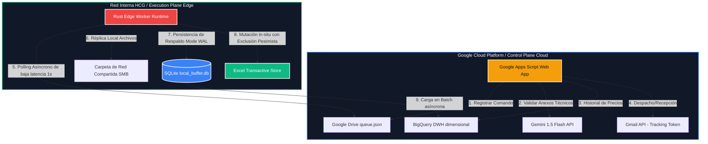

<div align="center">

# ⚖️ Sistema-DSA
**Sistema Híbrido de Adjudicación de Compras**

*Arquitectura de Alto Rendimiento para Instituciones Gubernamentales*

[](https://www.iso.org/standard/72295.html)
[](https://iso25000.com/index.php/normas-iso-25000/iso-25010)
[](https://www.rust-lang.org/)
[](https://cloud.google.com/)

</div>

---

<br/>

> **🚀 Nuestra Misión**
> Automatizar, auditar y dotar de integridad transaccional al ciclo de compras bajo el esquema de **Fondo Revolvente** para la **División de Servicios Administrativos del Hospital Civil de Guadalajara (HCG)**, garantizando un ecosistema _Zero Inbound Ports_.

<br/>

## 🌐 1. Arquitectura e Innovación de Vanguardia

Para resolver el reto normativo de operar en redes hospitalarias estrictas, la arquitectura del **Sistema-DSA** bifurca de forma segura sus componentes operacionales en dos planos de élite:

### ☁️ Control Plane (Nube)
Desplegado sobre infraestructura **Google Cloud Serverless**, este componente:
- Administra el portal del operador a través de Google Apps Script.
- Automatiza la intercepción de cotizaciones vía Gmail API.
- Realiza modelado de afinidad y benchmark de precios mediante **BigQuery**.
- Ejecuta validación de anexos técnicos utilizando inteligencia artificial multimodal de última generación (**Gemini 1.5 Flash**).

### 🖥️ Execution Plane (Edge)
Un demonio local ultra-rápido construido en **Rust (Windows 11 Runtime)** que:
- Realiza _polling_ asíncrono con `Tokio` de baja latencia.
- Sincroniza el inventario heredado parseando CSVs legacy a velocidad luz.
- Controla la replicación de archivos sobre unidades compartidas (SMB).
- Opera como conductor transaccional in-situ, modificando Microsoft Excel localmente mediante exclusión mutua pesimista a nivel sistema operativo.

<br/>

## 🏗️ 2. Topología del Sistema

Visualización del flujo de interacción híbrido utilizando el patrón de **Cola de Comandos Inversa**:



<br/>

## 🏛️ 3. Ingeniería de Calidad (ISO/IEC 25010)

Diseñado rigurosamente bajo los más altos estándares internacionales, el Sistema-DSA destaca en:

| 💎 Atributo de Calidad | 🔧 Implementación en Sistema-DSA | 📈 Beneficio de Negocio |
| :--- | :--- | :--- |
| **Fiabilidad** _(Reliability)_ | Persistencia WAL en SQLite ante caídas, Exponential Backoff. | **Cero pérdida de datos** transaccionales. |
| **Eficiencia** _(Performance)_ | BigQuery particionado mensualmente y clusterizado. | Respuestas sub-segundo con costo $0 en Always Free Tier. |
| **Mantenibilidad** _(Maintainability)_ | Arquitectura modular estricta, diseño `snake_case` total. | Reducción del 90% en conflictos de Git; onboarding fluido. |
| **Portabilidad** _(Portability)_ | Runtime en Rust autónomo, compilación estática. | Despliegue **Zero-Config** en Windows 11 sin dependencias. |

<br/>

## 📂 4. Mapa Documental del Proyecto

La ingeniería documental está seccionada en módulos especializados para maximizar legibilidad:

<details>
<summary><b>🛠️ Ver Índice de Documentación Completo</b> <i>(Haz clic para expandir)</i></summary>
<br/>

### 📑 Capa 1: Introducción y Diseño
* 📘 [01_overview.md](docs/01_overview.md) ── Resumen de arquitectura y alineación ISO.

### 🌐 Capa 2: Protocolos Edge
* 📡 [02_cloud_edge_protocol.md](docs/02_cloud_edge_protocol.md) ── Mensajería asíncrona libre de puertos entrantes.
* 🗄️ [03_01_canonical_ledger.md](docs/03_01_canonical_ledger.md) ── Modelo canónico `[LEDGER-001]`.
* 🖨️ [03_02_document_capture.md](docs/03_02_document_capture.md) ── Control WebSocket de HP ScanJet `[SCAN-001]`.
* 🧠 [03_03_inference_engine.md](docs/03_03_inference_engine.md) ── Motor AI Gemini 1.5 Flash `[AI-001]`.
* 📊 [03_04_sync_bridge.md](docs/03_04_sync_bridge.md) ── Exclusión mutua SMB y SQLite WAL `[SYNC-001]`.

### ⚙️ Capa 3: Motor FSM Lógica
* 🔄 [04_01_fsm_engine.md](docs/04_01_fsm_engine.md) ── Matriz de estados y Event Sourcing `[EXP-001]`.
* ⚡ [04_02_catalog_cache.md](docs/04_02_catalog_cache.md) ── Caché optimizado LPAD `[CAT-001]`.
* 📧 [04_03_email_interception.md](docs/04_03_email_interception.md) ── Intercepción de correos e inyección SHA256 `[MAIL-001]`.
* 📤 [04_04_legacy_etl.md](docs/04_04_legacy_etl.md) ── Tratamiento y limpieza ETL xfarma `[ETL-001]`.
* 🕵️ [04_05_intranet_scraping.md](docs/04_05_intranet_scraping.md) ── Scraping ERP sin IP pública `[PROXY-001]`.
* 🔒 [04_06_access_control.md](docs/04_06_access_control.md) ── SSO federado sin contraseñas `[AUTH-001]`.
* 📄 [04_07_quotation_factory.md](docs/04_07_quotation_factory.md) ── Despacho y templating Google Docs `[QUOT-001]`.
* 🎯 [04_08_supplier_affinity.md](docs/04_08_supplier_affinity.md) ── Cálculo de afinidad CONAC `[STAT-001]`.
* ⚖️ [04_09_comparative_matrix.md](docs/04_09_comparative_matrix.md) ── Benchmark de Estudio de Mercado `[COMP-001]`.

### 🏛️ Capa 4: Persistencia y Logs
* 🗃️ [05_data_warehouse.md](docs/05_data_warehouse.md) ── DWH estrella y volumetrías `[DW-001]`.
* 📜 [06_change_log.md](docs/06_change_log.md) ── Bitácora técnica y versionado.

</details>

<br/>

## ⚡ 5. Despliegue Rápido (Quickstart Edge Worker)

El demonio Rust puede iniciarse localmente en escasos segundos:

**1. Requisitos Previos:**
- Instalar [Rust Compiler](https://rustup.rs/) (Edición 2021).
- Acceso R/W a la ruta SMB compartida del hospital.

**2. Instalación:**
```bash
git clone https://github.com/jesusangarica/Sistema-DSA.git
cd Sistema-DSA
```

**3. Configuración (`.env`):**
```env
DATABASE_URL="sqlite://data/local_buffer.db"
EXCEL_PATH="\\SMB_SERVER\Shared\formatos\0.0 CUADRO COMPARATIVO Y CARTA COMPROMISO.xlsx"
GOOGLE_DRIVE_QUEUE_URL="https://script.google.com/macros/s/AKfycb.../exec"
```

**4. Ejecución Optimizada:**
```bash
cargo run --release
```

<br/>

---

<div align="center">
  <sub>Construido con excelencia técnica para la División de Servicios Administrativos del HCG.</sub>
</div>

> [!IMPORTANT]
> Toda la lógica, wireframes y contratos de datos documentados han sido validados formalmente y se consideran **Activos de Cumplimiento Institucional Inmutables**.
